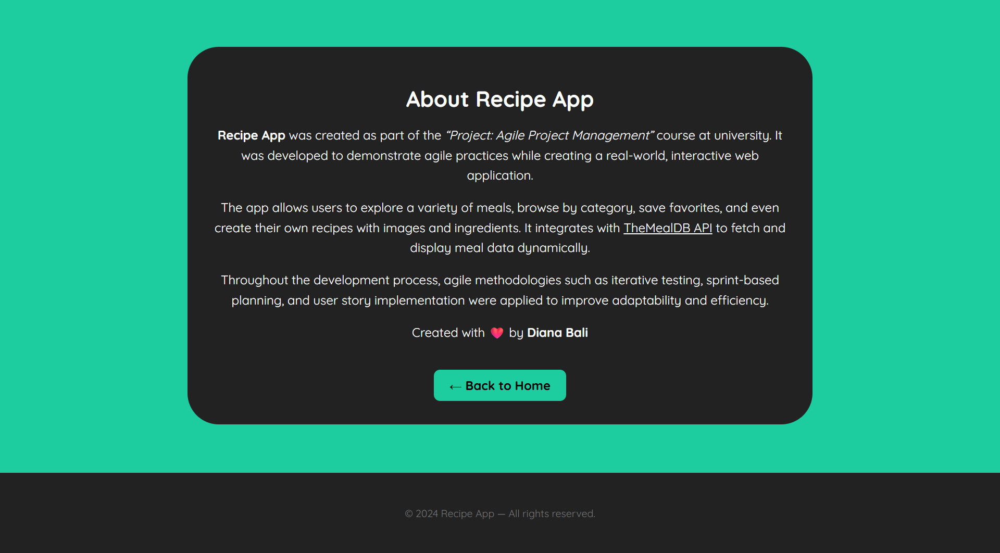
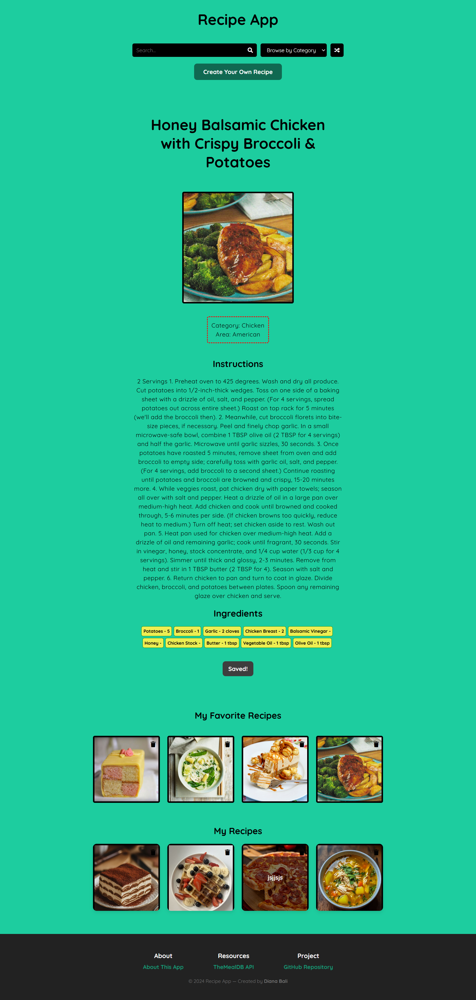

# Recipe App
A dynamic, interactive recipe browsing web application that allows users to search meals, explore categories, view detailed recipes, save favorites, and even create their own custom recipes.

### Features
Search Recipes
 - Search for meals by name using the search bar.
 - View search results as a responsive grid of recipe thumbnails.
 - Click a meal to view its details such as ingredients, instructions, area, and category.

Browse by Category
 - Use the dropdown menu to browse meals based on categories (e.g., Beef, Dessert, Seafood).
 - Meals load dynamically from TheMealDB API.

Random Recipe
 - Get inspired by a random recipe pulled from the API using the Random button.

Favorites System
 - Save recipes to your favorites.
 - Favorites persist using localStorage.
 - Remove favorites anytime.
 - Click a favorite to view its full recipe.

Create Your Own Recipes
 - Add custom recipes with: Name, Description, Ingredients, Image upload.
 - Custom recipes are stored locally using localStorage.
 - Users can click and view them just like API-generated meals.
 - Users can delete their own recipes.

Fully Responsive UI
 - Built with HTML, CSS, and JavaScript.
 - Layout adapts from 4-column grids to single-column on mobile.
 - Clean, modern aesthetic using Quicksand Google Font.

## Technologies used
 - HTML5
 - CSS3 - Responsive grid layout, Custom styling, Hover effects, Transitions.
 - Vanilla JavaScript - fetch() API requests, Event listeners, Dynamic DOM manipulation, JSON handling, `localStorage` for persistence.
 - TheMealDB API (https://www.themealdb.com/) - Search, Random meal, Category.
 - Font Awesome Icons
 - Google Fonts

## Installation guide
1. Clone this repository: `git clone https://github.com/dianabali/CSEBCSAPM01`
2. Open `index.html` in your browser.

## Preview

